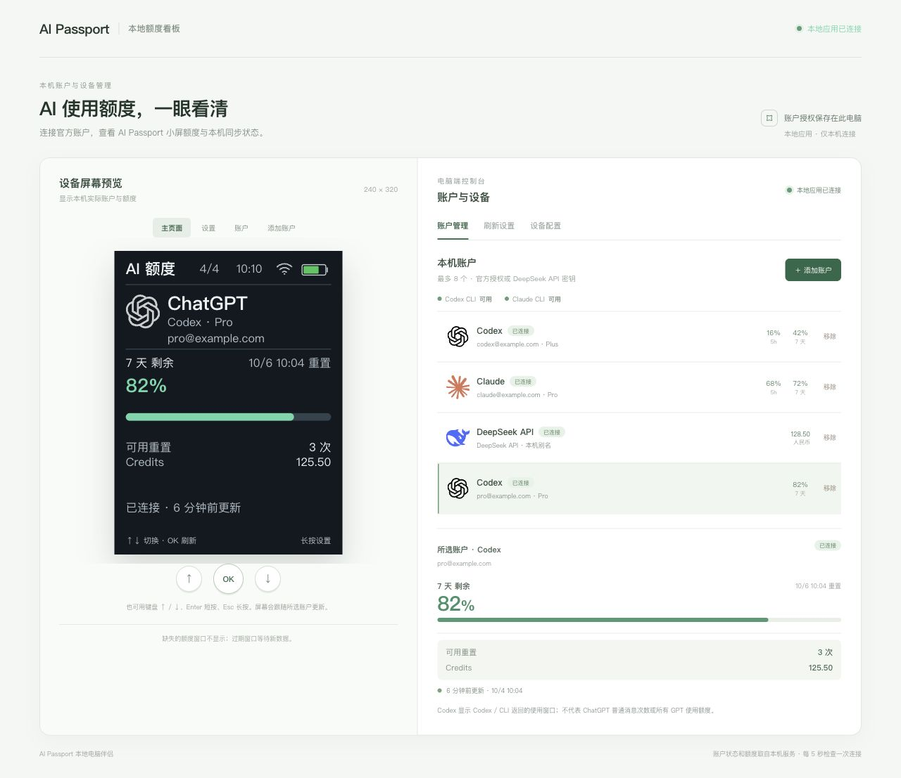
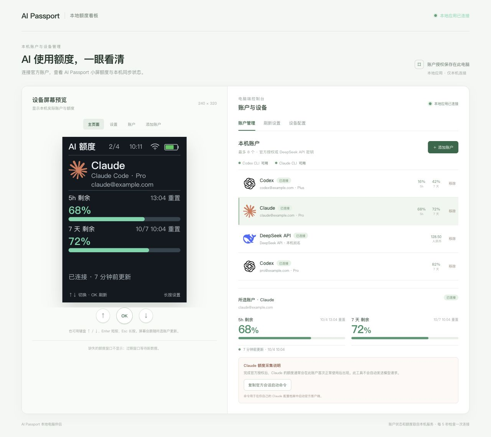

[简体中文](README.zh_CN.md) · English

# AI Passport Quota

A quota dashboard for the FoloToy AI Passport (ESP32-C3, 240 × 320 display), with a local desktop companion. Manage up to eight isolated Codex, Claude and DeepSeek accounts, view remaining subscription quota or RMB API balance, set refresh timing and screen timeout, and retain an offline device cache.

## Run the companion

Requirements: Node.js 22+, npm, OpenSSL, and the official Codex/Claude CLI for those providers. Device setup needs desktop Chrome or Edge with Web Serial, a data-capable USB cable and 2.4 GHz Wi-Fi. The computer and companion must stay running during synchronization.

```bash
git clone https://github.com/zesming/ai-passport-quota.git
cd ai-passport-quota/companion
npm ci
npm run build
npm start
```

Open **http://127.0.0.1:4317/**. On macOS, `start-dashboard.command` starts an already built installation; keep its terminal open. Optional overrides: `AIQ_CODEX_BIN`, `AIQ_CLAUDE_BIN`, `AIQ_STATE_DIR`.

1. Add Codex or Claude in Account management and complete official authorization. Each account gets an independent profile; existing CLI credentials are not imported.
2. Codex reports **Codex usage**, not all ChatGPT message limits. The five-hour and weekly windows display independently; missing windows are hidden, while a real 0% stays visible. Officially available Credits and positive banked-reset counts appear when supplied; Credits have no inferred currency.
3. For Claude, copy the page's session launch command and use that profile normally. A statusline callback after a normal response supplies quota; refresh never sends a paid model prompt.
4. For DeepSeek, add an API key from the [official portal](https://platform.deepseek.com/api_keys). The page shows RMB available balance, including grants and top-ups, from the [balance API](https://api-docs.deepseek.com/api/get-user-balance/). The name is a local label. Keys stay on the computer. Spending history, request counts and cumulative token totals are not supported.
5. Set automatic refresh to 1, 5, 15 or 30 minutes. Screen timeout accepts Never, 30 seconds, or 1/2/5/10 minutes; the default is 2 minutes.

Credentials live under `~/.local/share/ai-passport-quota/` or `AIQ_STATE_DIR`, in private account profiles outside the repository. Removing an account detaches it; Codex/Claude profile files are retained. Stop syncing revokes the device token.

## Connect and use the device

Install a verified firmware build using the [build and flash guide](docs/development/README.md). On an already configured device, long-press OK, select pairing with up/down and confirm with OK. The physical pairing window lasts 120 seconds.

In Device configuration, choose the computer's private IPv4 address, enter Wi-Fi details, and click Connect and configure. Select the ESP32-C3 USB Serial/JTAG device and wait for confirmation. Wi-Fi details travel directly from browser memory to USB. Device synchronization uses pinned HTTPS on the selected address, port **4318**; the settings page remains local-only on **4317**. Re-pair if the computer's IP changes. Close other serial tools and pairing tabs before connecting. If setup fails, refresh the page, reopen the physical window and re-enter Wi-Fi details; the page distinguishes no input, interrupted communication, unmatched acknowledgment and device rejection.

Up/down selects an account; short OK refreshes or confirms; long OK opens settings or returns. Long DOWN while awake turns the screen off. The first function-key gesture wakes only. The independent power key retains hardware long-press shutdown. Pairing suppresses automatic screen off.

Screen off stops device Wi-Fi, puts the LCD into Sleep In, pauses display refresh and worker polling, and permits CPU frequency scaling down to 40 MHz. Function-key sensing remains active. Wake first shows cached data, then reconnects and silently reads the companion cache without resetting the account-refresh deadline or showing source-refresh progress. An enabled overdue refresh runs afterward. The desktop keeps its own schedule. Expired windows wait for new source data. Actual current reduction and battery life have not been measured.

The status bar shows Wi-Fi connection, time after synchronization and proportional green battery fill. A diagonal mark means no battery reading. Green is styling, not a charging indication; no verified software charging-state source is available. The clock shows `--:--` until synchronized.

## Screenshots

These captures use isolated synthetic example accounts. The device preview is a web rendering, not a photograph; its clock uses computer time and its indicators do not establish live board telemetry.





[Full account dashboard](docs/screenshots/dashboard.jpg) · [Refresh settings](docs/screenshots/settings.jpg) · [USB device configuration](docs/screenshots/device-setup.jpg)

## Development

Start with [AGENTS.md](AGENTS.md). See the [developer guide](docs/development/README.md) for structure, checks and flashing, [application contracts](docs/applications/ai-quota-monitor.md) for provider/protocol/cache behavior, and [hardware reference](docs/hardware-design/AI_HARDWARE_DEVELOPMENT_GUIDE.md) for pins and BSP constraints. Dated changes and acceptance evidence belong in the [changelog](docs/CHANGELOG.md).

Firmware requires ESP-IDF **5.5.3**, ESP32-C3, 8 MB Flash and no PSRAM. Builds and simulations do not establish hardware acceptance. Real browser USB pairing, provider access and the remaining board checks require separate verification.

## Origin and license

Based on the MIT-licensed [FoloToy AI Passport](https://gitee.com/FoloToy/ai-passport), commit `0b9e4c81ee4421c0bac39ca3561d65a8285acd4a`. See [LICENSE](LICENSE) and [asset sources and licenses](assets/README.md).
