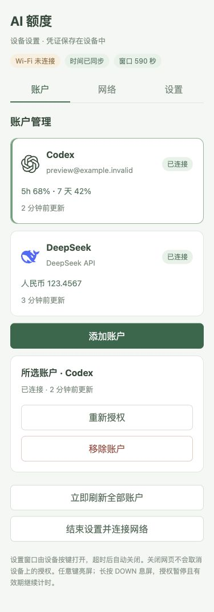

[简体中文](README.zh_CN.md) · English

# AI Passport Quota

A quota dashboard for the FoloToy AI Passport: ESP32-C3, 240 × 320 display, 8 MB Flash, no PSRAM. View Codex/Claude subscription quota and DeepSeek RMB balance, with reset countdowns, optional available resets and remaining Credits. Missing quota windows stay hidden; a real 0% remains visible.

## Choose a connection mode

| Mode | Providers | What must stay running |
| --- | --- | --- |
| Device direct | Experimental Codex login and DeepSeek API balance | Ordinary 2.4 GHz Wi-Fi or a phone hotspot |
| Computer sync | Codex, Claude and DeepSeek via the local companion | The manually started computer companion on the same network |

Direct mode stores its own accounts and settings on the device. It supports eight accounts and three saved networks. Computer accounts and direct accounts are separate; switching modes preserves both. An existing paired device initially keeps computer sync. Change to **Device direct** in phone settings and authorize fresh accounts there. Existing desktop credentials are not imported.

Codex direct login follows the official client's device-code implementation and uses its current public client ID. This is experimental compatibility, not a registered OAuth integration or stable public quota API. Account/workspace restrictions and provider changes may prevent authorization or queries. It reports **Codex usage**, not all ChatGPT message limits. Claude subscription login remains available through computer sync; direct Claude login is unavailable.

## Set up with a phone

First install firmware using the [build and flash guide](docs/development/README.md).

1. On the device, long-press OK, open **Network → Phone settings**. A temporary, password-protected hotspot opens for ten minutes.
2. Scan the first QR to join the device hotspot. Alternatively enter the displayed network name and password. Stay connected despite the phone's “no Internet” notice.
3. Short-press OK for the second QR and open its local settings page. That QR contains a temporary setup authorization; manually typing the bare address alone does not authorize changes.
4. Choose **Device direct**, enter your Wi-Fi or 2.4 GHz phone-hotspot details, then add Codex or a DeepSeek API key. Network/key submissions are pending until verified. End settings to let the device connect.
5. For Codex, starting authorization closes the device hotspot. Restore the phone's Internet connection or enable its configured hotspot, then scan the official authorization QR shown on the **device** and enter its code. The device completes authorization and saves its own tokens. Authorization lasts up to fifteen minutes.

The browser page is local to the device and needs no hosted account service. Its baseline works without Web Bluetooth; real phone scanning and network-switch behavior still depend on the phone. Enterprise certificate networks and Bluetooth network relay are not implemented. Use a compatible phone hotspot when ordinary Wi-Fi is unavailable. See the [portable design](docs/development/portable-connectivity.md) for UI, authorization and future network options.

DeepSeek displays only CNY total available balance, including grants and top-ups. A label is not an authenticated email. Spending history, request counts and cumulative token totals are unavailable from the documented balance API. A replacement key is checked before replacing the working key and balance.

Device credentials are outside Git, in a dedicated NVS partition. This engineering firmware does **not** encrypt them against physical Flash access. API keys, tokens and account passwords are never displayed by the settings API; provider passwords stay on official login pages.

## Use the device

Up/down selects an account. Short OK refreshes or confirms; long OK opens settings or returns. Long DOWN turns the screen off. The first function-key gesture wakes only. The independent power key retains hardware long-press shutdown.

Automatic refresh accepts 1/5/15/30 minutes. Screen timeout accepts Never, 30 seconds, or 1/2/5/10 minutes. Screen off stops Wi-Fi, phone setup and outbound requests. An already admitted request may finish; received replacement tokens are saved even after screen off. Authorization pauses while asleep and its expiry continues. Wake shows cache first and reconnects. Direct mode queries providers only when a manual request or enabled timer is due; computer sync also reads its companion cache silently. Wake does not postpone source refresh.

The status bar shows Wi-Fi, UTC+8 time after synchronization and proportional green battery fill. Green is styling, not a verified charging indication. Battery life and sleep current have not been measured.

## Optional computer companion

Requires Node.js 22+, npm, OpenSSL and the official Codex/Claude CLI for those providers. USB pairing uses desktop Chrome/Edge with Web Serial.

```bash
git clone https://github.com/zesming/ai-passport-quota.git
cd ai-passport-quota/companion
npm ci
npm run build
npm start
```

Open **http://127.0.0.1:4317/** and add isolated accounts. For Claude, use the page's session command; official statusline observations supply quota after normal use. No refresh sends a paid model prompt.

Choose **Computer pairing** on the device; its USB window lasts 120 seconds. Enter the computer's private IPv4 address and Wi-Fi details in Device configuration, connect USB, and wait for acknowledgment. Device synchronization uses pinned HTTPS on port **4318**. Re-pair when the computer address changes. Keep the companion terminal open; no autostart service is installed. Profiles stay under `~/.local/share/ai-passport-quota/` or `AIQ_STATE_DIR`.

## Screenshots and development

Screenshots use isolated synthetic accounts; web previews do not establish hardware telemetry.




Start with [AGENTS.md](AGENTS.md), the [developer guide](docs/development/README.md) and [application contracts](docs/applications/ai-quota-monitor.md). Validation and device acceptance are recorded in the [changelog](docs/CHANGELOG.md).

Based on the MIT-licensed [FoloToy AI Passport](https://gitee.com/FoloToy/ai-passport), commit `0b9e4c81ee4421c0bac39ca3561d65a8285acd4a`. See [LICENSE](LICENSE) and [asset licenses](assets/README.md).
