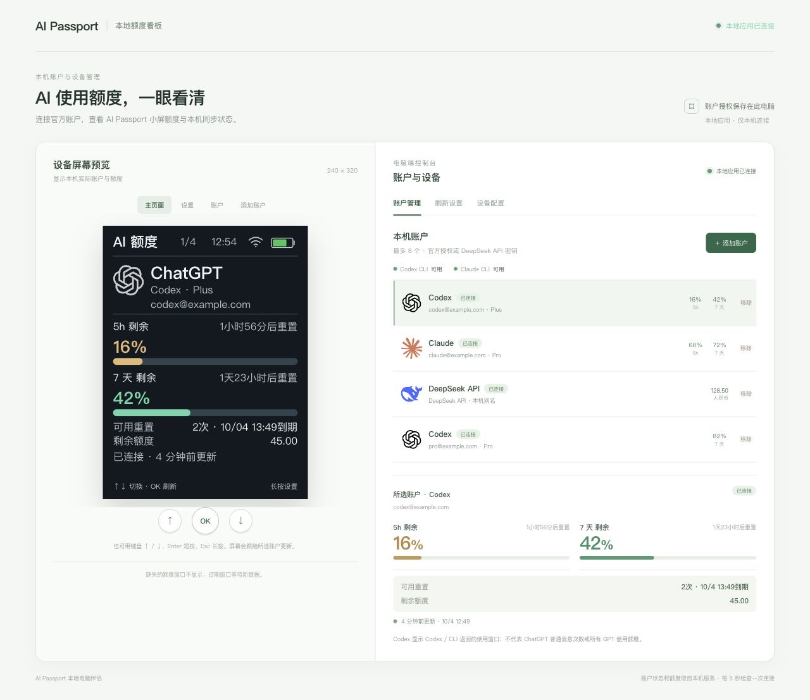
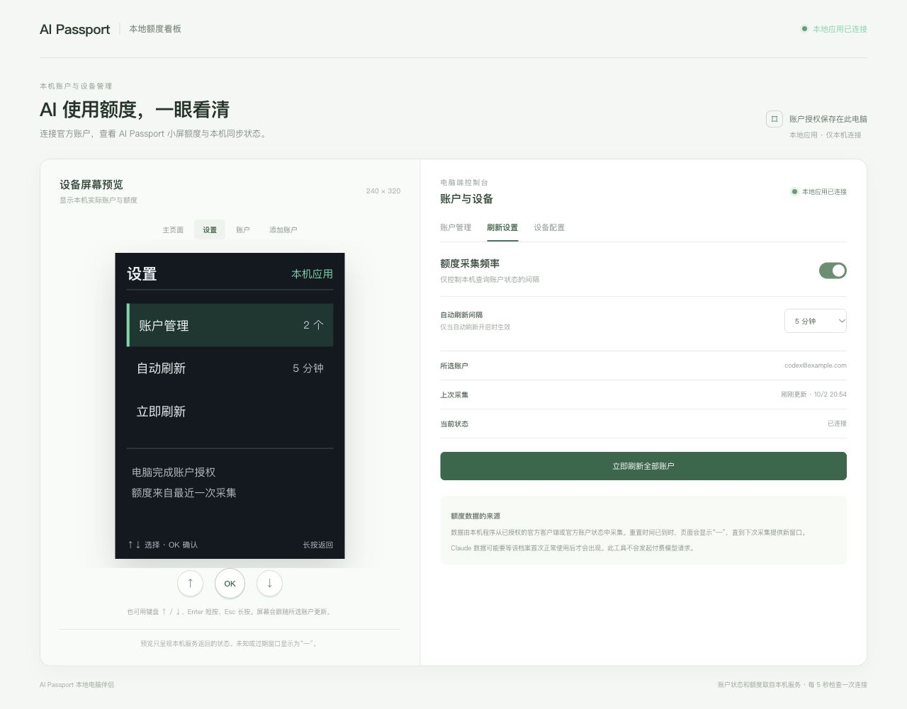
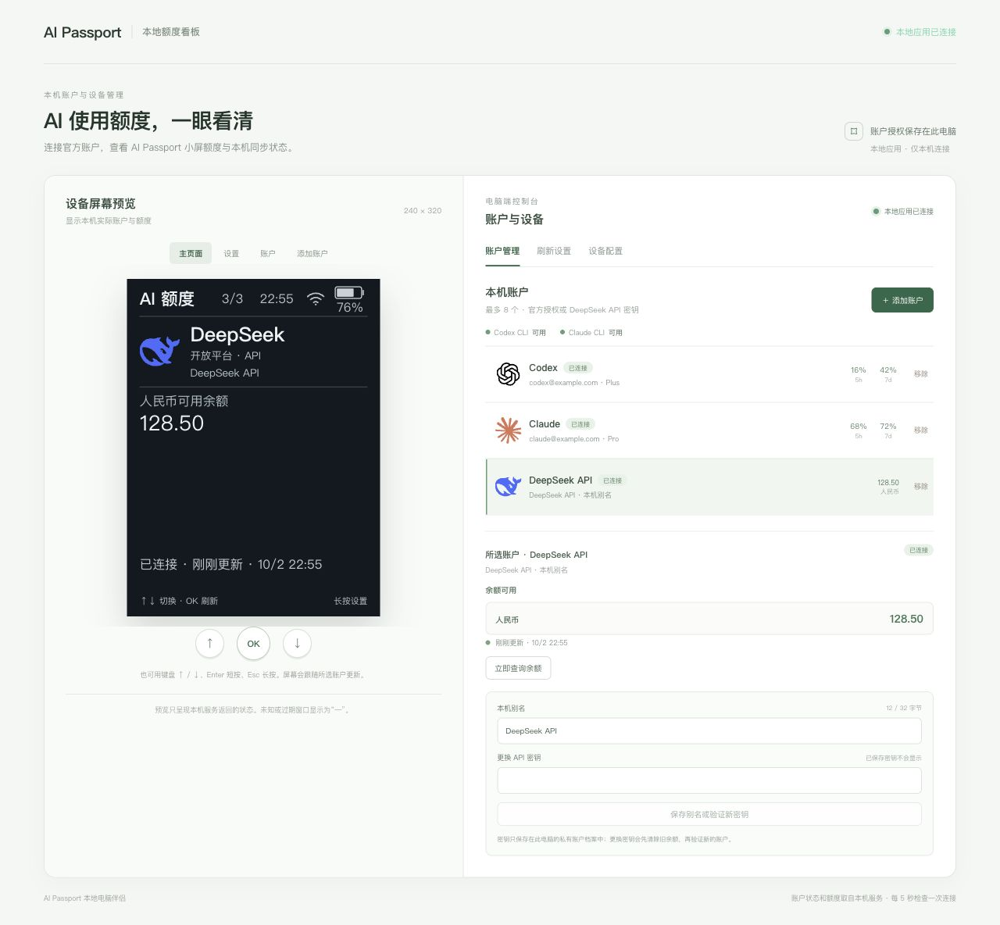
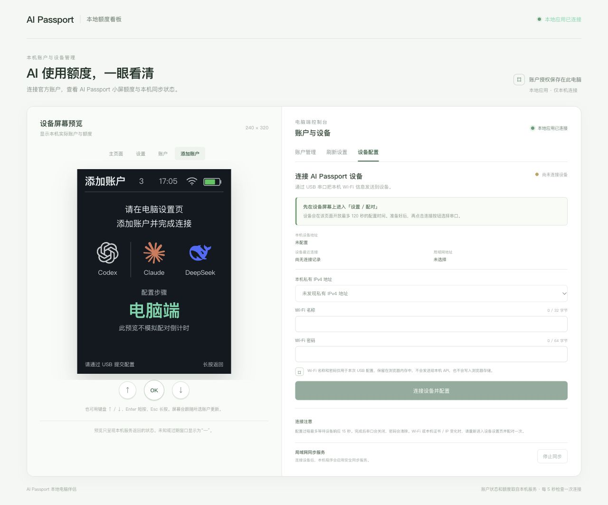

简体中文 · [English](README.md)

# AI Passport Quota

面向 FoloToy AI Passport（ESP32-C3、240 × 320 屏幕）的额度看板，配套本地电脑管理应用。支持最多八个隔离的 Codex、Claude 和 DeepSeek 账号，显示订阅剩余额度或人民币 API 余额，设置刷新与息屏时间，并保留设备离线缓存。

## 启动电脑端

需要 Node.js 22+、npm、OpenSSL，以及所用服务的官方 Codex/Claude CLI。设备配置需要支持 Web Serial 的桌面 Chrome 或 Edge、可传输数据的 USB 线和 2.4 GHz Wi-Fi。同步期间电脑与管理应用须保持运行。

```bash
git clone https://github.com/zesming/ai-passport-quota.git
cd ai-passport-quota/companion
npm ci
npm run build
npm start
```

打开 **http://127.0.0.1:4317/**。macOS 可用 `start-dashboard.command` 启动已构建的应用，请保留终端窗口。可选覆盖项：`AIQ_CODEX_BIN`、`AIQ_CLAUDE_BIN`、`AIQ_STATE_DIR`。

1. 在账号管理中添加 Codex 或 Claude，并完成官方授权。每个账号使用独立 profile，不导入已有 CLI 凭证。
2. Codex 显示 **Codex 用量**，不代表全部 ChatGPT 消息限制。缺失的额度窗口保持未知。
3. Claude 需复制页面的会话启动命令，正常使用该 profile。正常响应后的 statusline 回调提供额度；刷新不发送付费模型提示。
4. DeepSeek 使用[官方平台](https://platform.deepseek.com/api_keys)的 API key。页面通过[余额接口](https://api-docs.deepseek.com/api/get-user-balance/)显示人民币可用余额，包含赠款和充值。名称是本地标签。密钥只留在电脑端。不支持消费历史、请求次数或累计 token 总数。
5. 自动刷新可选 1、5、15 或 30 分钟；息屏可选从不、30 秒或 1/2/5/10 分钟，默认 2 分钟。

凭证存于仓库外的 `~/.local/share/ai-passport-quota/` 或 `AIQ_STATE_DIR`，各账号目录权限仅限当前用户。删除账号会立即解除关联，Codex/Claude profile 文件仍保留。停止同步会撤销设备令牌。

## 配置与使用设备

先按[构建与刷写指南](docs/development/README.zh_CN.md)安装已验证固件。已配置设备长按 OK，以上下键选择配对，再按 OK 确认。物理配对窗口持续 120 秒。

在设备配置页选择电脑的私有 IPv4 地址，输入 Wi-Fi 信息，点击连接并配置。选择 ESP32-C3 USB Serial/JTAG 设备并等待确认。Wi-Fi 信息直接从浏览器内存送往 USB。设备连接所选地址 **4318** 端口的固定证书 HTTPS；设置页 **4317** 端口仅允许本机访问。电脑 IP 改变后须重新配对。连接前关闭其他串口工具和配对标签页。失败时刷新页面、重新打开物理窗口并重新输入 Wi-Fi 信息；页面区分无输入、通信中断、确认不匹配和设备拒绝。

上下键切换账号；短按 OK 刷新或确认；长按 OK 打开设置或返回。亮屏时长按 DOWN 息屏。息屏后的第一个功能键手势仅唤醒。独立电源键保留硬件长按关机行为。配对期间不自动息屏。

息屏暂停设备网络操作。唤醒后静默读取电脑端缓存，保留原账号刷新截止时间；已启用且到期的刷新随后执行。电脑端维持独立刷新计划。离线数据保留状态标识；过期或缺失窗口不会变成满额。

状态栏显示 Wi-Fi 连接、同步后的时间和绿色比例电量。斜线表示电量读取不可用。绿色只是样式，不表示充电；目前没有已验证的软件充电状态来源。时钟同步前显示 `--:--`。

## 截图

截图使用隔离的合成示例账号。设备预览是网页渲染，不是真机照片；其时钟使用电脑时间，指示图标不能证明实时板卡遥测。






## 开发

从 [AGENTS.md](AGENTS.zh_CN.md) 开始。[开发指南](docs/development/README.zh_CN.md)说明结构、校验和刷写；[应用契约](docs/applications/ai-quota-monitor.zh_CN.md)说明来源、协议与缓存；[硬件参考](docs/hardware-design/AI_HARDWARE_DEVELOPMENT_GUIDE.zh_CN.md)说明引脚和 BSP 约束。有日期的变化与验收证据记入[变更日志](docs/CHANGELOG.zh_CN.md)。

固件使用 ESP-IDF **5.5.3**，目标 ESP32-C3、8 MB Flash、无 PSRAM。构建和模拟不代表硬件验收；真实浏览器 USB 配对、服务账号访问及剩余板卡检查须单独验证。

## 来源与许可证

基于 MIT 许可的 [FoloToy AI Passport](https://gitee.com/FoloToy/ai-passport)，起点提交为 `0b9e4c81ee4421c0bac39ca3561d65a8285acd4a`。见 [LICENSE](LICENSE) 与[资源来源和许可证](assets/README.zh_CN.md)。
