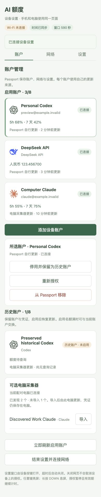

简体中文 · [English](README.md)

# AI Passport Quota

FoloToy AI Passport 额度看板：ESP32-C3、240 × 320 屏幕、8 MB Flash、无 PSRAM。展示 Codex/Claude 额度窗口、重置倒计时、来源提供的可用重置与剩余额度，以及 DeepSeek 人民币余额。缺失窗口隐藏，真实 0% 保留。

## 配置设备

Passport 保存账户、Wi-Fi 和刷新设置，手机与电脑打开同一个设备设置页。设备自行更新的账户无需电脑服务。最多八个启用账户、三个普通 2.4 GHz 网络。

1. 按[开发指南](docs/development/README.zh_CN.md)安装固件。
2. 长按 OK → **设备设置 → 热点**。用第一步二维码或屏幕上的名称、密码连接临时热点。
3. 短按 OK 显示网页二维码，连接热点后扫码。电脑也可进入手动输入步骤，在浏览器输入完整地址和临时设置密钥。
4. 保存可联网的 Wi-Fi 或兼容手机热点，添加 Codex 或 DeepSeek API 密钥，结束设置后由设备联网验证。
5. Codex 授权会关闭设备热点。手机或电脑恢复互联网连接，打开 Passport 显示的官方授权页并输入验证码。Passport 保存独立签发的凭据。

本地网页包含账户、网络、设置三个页签，无需云端服务。直接输入裸地址会显示设置密钥输入框。设置窗口开放十分钟，重新打开需要操作设备。网页不返回 API 密钥或令牌。设备凭据存独立 NVS 分区；本固件未加密 Flash，不能防止物理读取。

Codex 采用官方客户端设备码流程的实验性兼容实现，并非已注册的第三方 OAuth 集成或稳定公开额度 API。展示的是 **Codex 用量**，不代表全部 ChatGPT 消息限制。DeepSeek 只显示人民币总可用余额；余额 API 不提供消费历史、请求次数或累计 Tokens。Claude 订阅仍需可选电脑采集器。

## 使用

上/下键切换账户；短按 OK 刷新或确认；长按 OK 打开设置或返回。长按下键息屏，首次完整功能键操作只亮屏。独立电源键保持硬件长按关机。

刷新间隔支持 1/5/15/30 分钟；自动息屏支持从不、30 秒、1/2/5/10 分钟。息屏关闭 Wi-Fi、停止新网络请求，收到的新凭据仍完成保存。亮屏先显示缓存，再恢复联网；手动刷新或到点时才查询来源。网络、校时状态与账户错误分别显示。

网络信息展示连接状态和已保存的 Wi-Fi 名称。设备设置提供热点账户/设置管理，以及可选采集器的 USB 配对。

状态栏展示 Wi-Fi、校时后的 UTC+8 时间，以及按实际电量比例填充的绿色电池。绿色仅为样式，不代表已验证的充电状态。企业证书网络与蓝牙网络中转尚未实现，请使用普通 Wi-Fi 或兼容手机热点。

## 可选电脑采集器

电脑来源账户使用同一个设备列表和设置。电脑离线只影响这些账户。迁移保留已有资料；超过八个启用账户的历史账户可停用、启用，不必删除凭据。Codex/DeepSeek 可在 Passport 上明确重新授权以更换来源，不导入电脑令牌，也不按邮箱自动合并。

需要 Node.js 22+、npm、OpenSSL；Codex/Claude 还需要官方客户端。手动启动：

```bash
git clone https://github.com/zesming/ai-passport-quota.git
cd ai-passport-quota/companion
npm ci
npm run build
npm start
```

打开 **http://127.0.0.1:4317/**。可选兼容采集器使用隔离私有账户档案。Claude 在正常使用时由官方 statusline 提供额度；刷新不发送付费模型提示。在桌面 Chrome/Edge 中先点**连接 USB**，等待小屏启动，再打开设备的**设备设置 → USB**窗口并发送配置。设备通过 **4318** 端口固定证书 HTTPS 同步。不安装自启动。电脑私有资料位于 `~/.local/share/ai-passport-quota/` 或 `AIQ_STATE_DIR`。

## 截图与开发

截图使用隔离示例账户，网页预览不证明硬件实时状态。




继续开发先读 [AGENTS](AGENTS.zh_CN.md)、[开发指南](docs/development/README.zh_CN.md)和[应用契约](docs/applications/ai-quota-monitor.zh_CN.md)。验证历史放在[变更日志](docs/CHANGELOG.zh_CN.md)。

基于 MIT 许可的 [FoloToy AI Passport](https://gitee.com/FoloToy/ai-passport)，提交 `0b9e4c81ee4421c0bac39ca3561d65a8285acd4a`。见 [LICENSE](LICENSE)和[素材许可](assets/README.zh_CN.md)。
